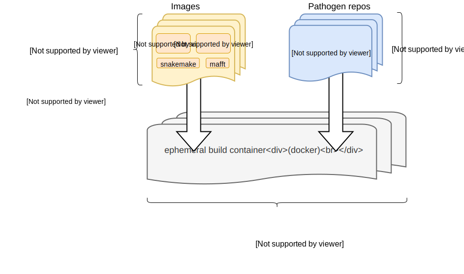

==============
Nextstrain CLI
==============

.. hint::
   This is reference documentation for the Nextstrain CLI (command-line
   interface).  If you're just getting started with Nextstrain, please see
   :doc:`our general documentation <docs:index>` instead.

The Nextstrain CLI is a program called ``nextstrain``.  It aims to provide a
consistent way to run and visualize pathogen builds and access Nextstrain
components like :doc:`Augur <augur:index>` and :doc:`Auspice <auspice:index>`
computing platforms, such as
:doc:`/runtimes/docker`,
:doc:`/runtimes/conda`,
:doc:`/runtimes/singularity`, and
:doc:`/runtimes/aws-batch`.

.. note::
    If you're unfamiliar with Nextstrain builds, you may want to follow our
    :doc:`docs:tutorials/running-a-phylogenetic-workflow` tutorial first and
    then come back here.

Table of Contents
=================

.. toctree::
    :maxdepth: 3

    Introduction <self>
    installation
    upgrading
    AWS Batch <aws-batch>

.. toctree::
    :caption: Commands
    :name: commands
    :titlesonly:
    :maxdepth: 3

    commands/run
    commands/build
    commands/view
    commands/deploy
    commands/remote/index
    commands/remote/list
    commands/remote/download
    commands/remote/upload
    commands/remote/delete
    commands/shell
    commands/update
    commands/setup
    commands/check-setup
    commands/login
    commands/logout
    commands/whoami
    commands/authorization
    commands/version

.. toctree::
    :caption: Remotes
    :titlesonly:

    nextstrain.org <remotes/nextstrain.org>
    Amazon S3 <remotes/s3>

.. toctree::
    :caption: Runtimes
    :titlesonly:

    Overview <runtimes/index>
    Docker <runtimes/docker>
    Conda <runtimes/conda>
    Singularity <runtimes/singularity>
    AWS Batch <runtimes/aws-batch>
    Ambient <runtimes/ambient>

.. toctree::
    :caption: Configuration
    :titlesonly:

    Config file <config/file>
    Paths <config/paths>

.. toctree::
    :caption: Development
    :titlesonly:

    glossary

Big Picture
===========

.. XXX TODO: Move this into our explanatory doc pages when they're written.

The Nextstrain CLI glues together many different components.  Below is a brief
overview of the `big picture <_static/big-picture.svg>`__:

Indices and Tables
==================

* :ref:`genindex`
* :ref:`search`
